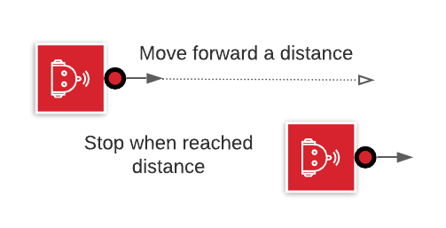

# Task 1 instruction

Goal: Move forward a specific distance

1. set robot at a start point.
2. command robot to move a metric foot.
3. have the robot stop when reaching the destination.

## Solution Code

|Spike|EV3|Vex
|-----|---|---
[spike code](../spike-prime/task1.py)| [EV3 code](../ev3/task1.py) | X