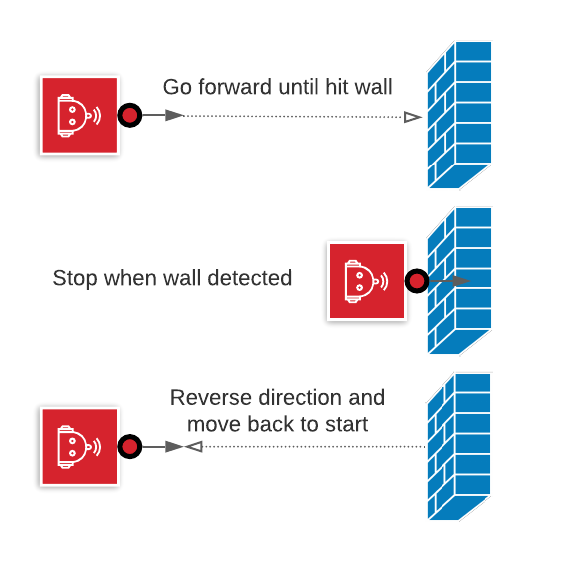

# Task 10 instruction

Goal: move forward until bumped, stop, then reverse.

1. drive forward
2. when detecting an obstruction, stop.
3. automatically reverse direction.
4. return to start position (with same orientation)

## Option

* safely turn around after detecting obstruction

## Solution Code

the source code is shared across multiple tasks.  
invoke `task10()`

HINT: `start_with_backup = True`, it helps to move away from previous collisions

Spike|EV3|Vex
-----|---|---
[spike code](../spike-prime/task10-12.py)| X | X