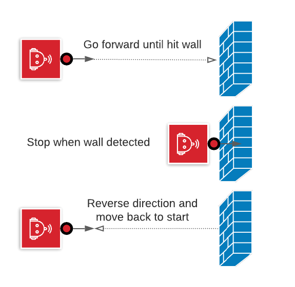

# Task 11 instruction

Goal: move forward until bumped, stop, then reverse.  Follow process 4 times.  
HINT: same action as Task10, just do it four(4) times

1. drive forward
2. when detecting an obstruction, stop.
3. automatically reverse direction.
4. return to start position (with same orientation)
5. loop back to start of process and do again until completed 4 times.

## Option

* safely turn around after detecting obstruction

## Solution Code

the source code is shared across multiple tasks.  
invoke `task11()`

HINT: `start_with_backup = True`, it helps to move away from previous collisions

Spike|EV3|Vex
-----|---|---
[spike code](../spike-prime/task10-12.py)| X | X
