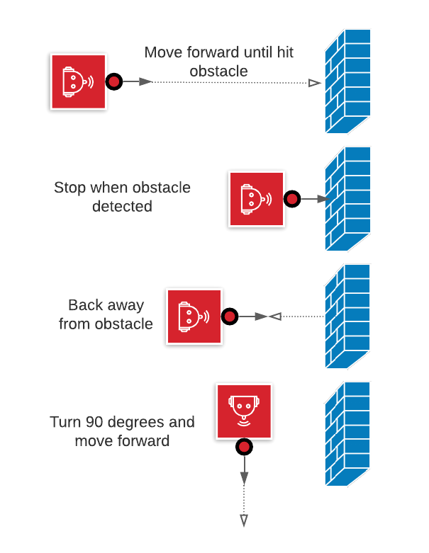

# Task 12 instruction

Goal: move forward until bumped, move back slightly, turn and continue on.

1. drive forward
2. when detecting an obstruction, stop.
3. automatically reverse direction and move away from the wall slightly.
4. turn right 90 degrees.
5. execute step #1 again.

## Solution Code

the source code is shared across multiple tasks.  
invoke `task12()`

HINT: `start_with_backup = True`, it helps to move away from previous collisions

Spike|EV3|Vex
-----|---|---
[spike code](../spike-prime/task10-12.py)| X | X
