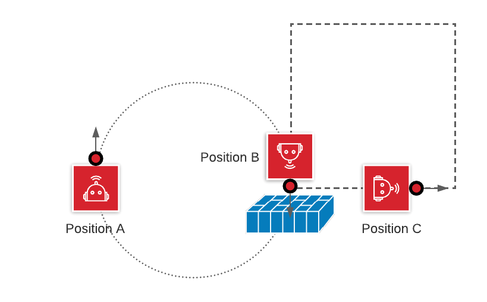

# Task 13 instruction

Goal: circle until hit - then traverse a square

1. draw a circle
2. detect an obstacle on the path of the circle, turn left
3. draw a square

## Solution Code

|Spike|EV3|Vex
|-----|---|---
[spike code](../spike-prime/task13.py)| X | X