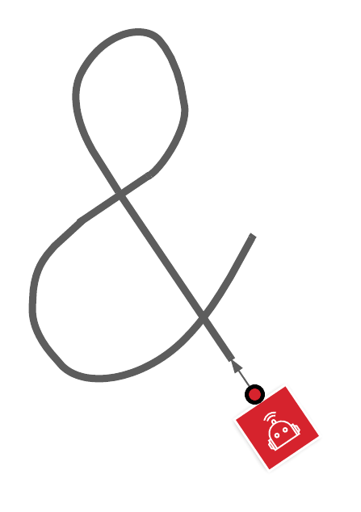

# Task 18 instruction

Goal: follow line

1. find line
2. follow line until end
3. turn around
4. follow line back to start

(Extra) While following line, detect intersections and randomly choose a path.

## Solution Code

|Spike|EV3|Vex
|-----|---|---
[spike code](../spike-prime/task18.py)| X | X