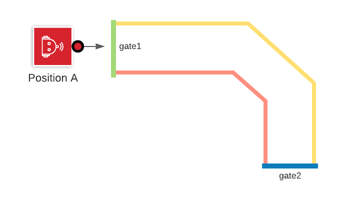

# Task 19 instruction

Goal: Stay inside a race track

1. detect starting gate of path
2. look up color of lines (left & right) from the starting gate
3. traverse path
4. detect second gate
5. turn around
6. traverse path
7. stop at original starting gate

## Solution Code

|Spike|EV3|Vex
|-----|---|---
[spike code](../spike-prime/task19.py)| X | X