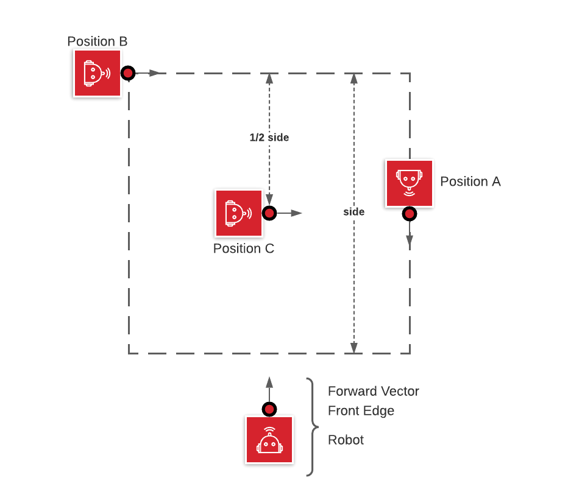

# Task 2 instruction

Goal: Draw a square

1. align the robot to a square on the floor.
2. have the robot traverse all four edges and corners of the square.
3. stop the robot where it started.

## Solution Code

|Spike|EV3|Vex
|-----|---|---
[spike code](../spike-prime/task2.py)| [EV3 code](../ev3/task2.py) | X