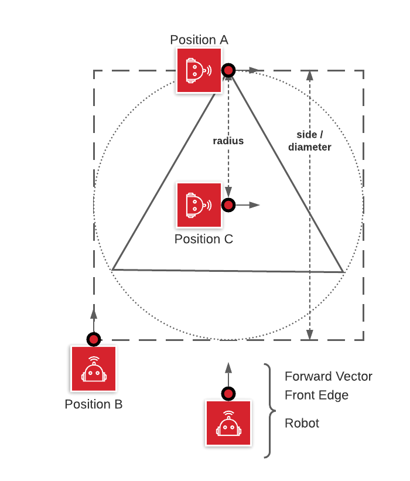

# Task 3 instruction

Goal: Draw an equilateral triangle

1. align the robot to a square.
2. traverse the shape of a triangle.
3. adjust your algorithm to different start positions.

## Solution Code

|Spike|EV3|Vex
|-----|---|---
[spike code](../spike-prime/task3.py)| [EV3 code](../ev3/task3.py) | X