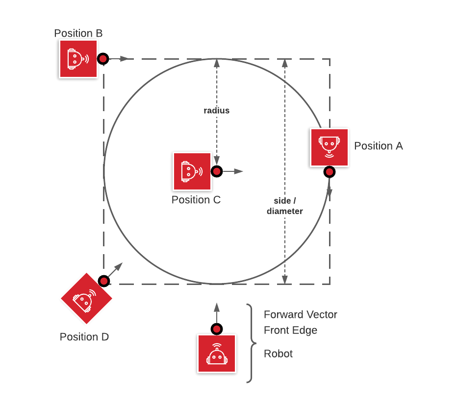

# Task 4 instruction

Goal: Draw a circle

1. align the robot to a square.
2. have the robot traverse a circle circumscribed in the square.
3. have the robot return to its starting point

## Starting Positions for Robot

A. at edge of circle, center aligned on side of square, pointed along square side (default)  
B. at corner of square pointed along square side  
C. center of circle/square, can be pointed anywhere  
D. corner of square, pointed at center of circle  

## Solution Code

|Spike|EV3|Vex
|-----|---|---
[spike code](../spike-prime/task4.py)| [EV3 code](../ev3/task4.py) | X

## Solution Code verifying turning accuracy

MEASURE COMPLETENESS OF CIRCLE  

|Spike|EV3|Vex
|-----|---|---
[spike code](../spike-prime/task4-verify.py)| X | X
