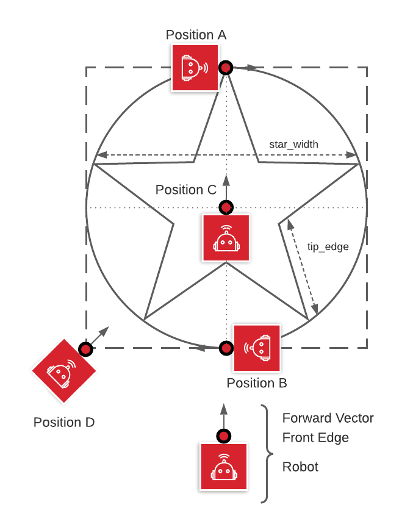
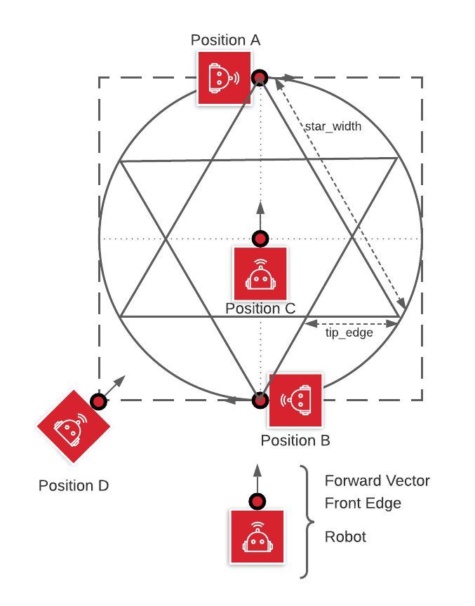

# Task 5 instruction

Goal #1: Draw a 5 point Star while only trying to trace the star's perimeter

## Starting Positions for Robot

A. at tip of start, center aligned on side of square, pointed along square side (default)  
B. opposite of star tip, center aligned on side of square, pointed along square side  
C. center of star/square, pointed at star tip  
D. corner of square, pointed at center of star  

Goal #2: Draw a 6 point Star

## Options

1. traverse two overlapping triangles, offset by 60 degrees
2. traverse 12 sided polygon

## Solution Code

|Spike|EV3|Vex
|-----|---|---
[spike code](../spike-prime/task5.py)| X | X